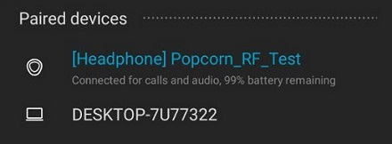
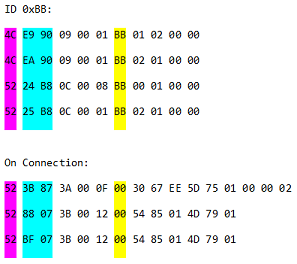

## Galaxy Buds+ Debug Features

Random findings that were **not** referenced in the official Android app and only known to the Samsung team. Until now, at least.

All of these messages can be transmitted/received using the built-in data stream inspector of the Unofficial Buds Manager (see Settings > Enter developer mode). 

## Contents

- [Galaxy Buds+ Debug Features](#galaxy-buds-debug-features)
- [Contents](#contents)
  - [Disconnect](#disconnect)
  - [Manually cause crashes](#manually-cause-crashes)
  - [Forcefully shutdown](#forcefully-shutdown)
  - [Firmware debug mode](#firmware-debug-mode)
  - [Unused pairing mode](#unused-pairing-mode)
  - [Close A2DP transmission channel](#close-a2dp-transmission-channel)
  - [Dump Bluetooth bonded list and link-keys](#dump-bluetooth-bonded-list-and-link-keys)
  - [Debug information](#debug-information)
    - [0xA9 (MAC, FW version, ...)](#0xa9-mac-fw-version-)
    - [0xB6 (Unknown)](#0xb6-unknown)
    - [0xCE (Unknown)](#0xce-unknown)
    - [Other unknown debug response triggers](#other-unknown-debug-response-triggers)
  - [Generic event](#generic-event)
  - [Unknown actions](#unknown-actions)
    - [0xCF (207d)](#0xcf-207d)
    - [0xD0 (208d)](#0xd0-208d)

### Disconnect

Simply disconnects the device without automatically reconnecting by itself, unless the host attempts to reconnect.

| Message ID | Payload | Type    |
| ---------- | ------- | ------- |
| 0x27 (39d) | *Empty* | Request |

### Manually cause crashes

It is possible to cause CPU assertion exceptions and force the device to reboot and reconnect. Once reconnected, the `USAGE_REPORT` message has the `EAST` counter incremented by a value between one and four, as it describes the count of recent exceptions raised.

| Message ID | Payload | Type    |
| ---------- | ------- | ------- |
| 0x3D (61d) | *Empty* | Request |
| 0x52 (82d) | *Empty* | Request |

Returns one zero-byte as confirmation.

### Forcefully shutdown

This appears to shut the earbuds completely down, it could also cause a severe crash that the earbuds are unable to recover from. It can be rebooted by inserting both earbuds into the case (closing not required). `EAST` counter is not incremented.

| Message ID | Payload | Type    |
| ---------- | ------- | ------- |
| 0x53 (83d) | *Empty* | Request |

Returns one zero-byte as confirmation.

### Firmware debug mode

This message disconnects the Buds+ from your host device and enables an unknown development mode. (In some cases the device appears to remain connected). You may need to re-couple the device with your host, as it changes its Bluetooth advertising name to `Popcorn_RF_Test` (whereas Popcorn is the codename of the Buds+). In my case, the left earbud was decoupled from the right one, so only the left earbud was connectable. However, as I placed the right bud into the case and closed it, the connection to the left earbud also died. By then, the buds were undetectable by any devices, however, after placing both in the opened case and long-pressing both touchpads, I was able to recouple them with each other and to restore the normal behaviour. I noticed one severe sound freeze a few minutes after this procedure (which required me to reboot them). Also, my Android device was still unable to detect the earbuds after they had been unpaired. Only a factory reset via the Unofficial Buds Manager solved this issue. **Try this at your own risk. Not recommended.**

| Message ID | Payload | Type    |
| ---------- | ------- | ------- |
| 0x56 (86d) | *Empty* | Request |

Does not respond with any message.

**Attachments:**



### Unused pairing mode

This message causes the both earbuds to play a connection jingle. If already connected to a device, the earbuds will disconnect, enter pairing mode and advertise themselves to other Bluetooth host devices. This is probably left-over from the original Galaxy Buds firmware, as they supported to enter pairing mode when both touchpads were simultaneously long-pressed. I extracted this connection sound from the firmware update image (version ATH7), listen to it [[here]](screenshots/budsplus_pairingmode.mp3).

| Message ID  | Payload | Type    |
| ----------- | ------- | ------- |
| 0x72 (114d) | *Empty* | Request |

Does not respond with any message.

### Close A2DP transmission channel

This message closes and disconnects the A2DP channel (used for audio/microphone transmission). The serial RFCOMM connection, however, remains alive and can still be accessed. Also returns unknown message ID `0xF2 (242d)`. Appears to increment `EAST` value.

| Message ID  | Payload | Type    |
| ----------- | ------- | ------- |
| 0xBB (187d) | *Empty* | Request |

No direct response, triggers one of ID events

### Dump Bluetooth bonded list and link-keys

This message dumps the Bluetooth BR/EDR and LE bonded list and known devices as ASCII strings. This includes all Bluetooth link-keys and peer mac-addresses. This applies to local **and** remote Bluetooth devices (Local = Secondary earbud). The information is sent one message per line  (using ID `0xD6`) . Additionally, the device sends the build date/time, developer name and firmware version as an ASCII CSV-list using message ID `0xD4 (212d)`.

Example response (original order):

| Message ID | ASCII Payload                                                |
| ---------- | ------------------------------------------------------------ |
| 0xD4       | `Aug 25 2020, 08:40:32, SWDD6019, R175XXU0ATH7`              |
| 0xD6       | `bonded bd.addr:a0afbd7e4a40, brkey:0e54a1c22d93dd7169xxxx`  |
| 0xD6       | `local bd.addr:807b3e2153ac, peer bd.addr:807b3e2179ec`      |
| 0xD6       | `local le.addr:c0f67c42a659, peer le.addr:c0f67c42f2d9, lekey:5ebc8xxxx` |
| 0xD6       | `## Show bonded list ##`                                     |
| 0xD6       | `name:My Galaxy, type:BR/EDR(1), CoD:5a020c, addr:4cdd31a42d16, linkkey:fddbe2xxxx` |
| 0xD6       | `name:DESKTOP-7U, type:BR/EDR(1), CoD:2a010c, addr:a0afbd7e4a40, linkkey:0c22d6xxxx` |
| 0xD6       | `name:DESKTOP-7U, type:BR/EDR(1), CoD:2a010c, addr:a0afbd7e4a40, linkkey:0e54a1xxxx` |

It is also possible to send a request using `0xD6 (214d)` with a bonded mac-address in the payload, which is then removed from the internal device list. However, it behaves very "randomly" and doesn't really seem to work.

If an invalid address was provided the device responds with:

| Message ID | ASCII Payload                                |
| ---------- | -------------------------------------------- |
| 0xD6       | `Wrong bonded bd.addr:000000000000, size: 0` |

Invoked by:

| Message ID  | Payload | Type    |
| ----------- | ------- | ------- |
| 0xD4 (212d) | *Empty* | Request |

### Debug information

This section collects all message IDs that return (extensive) information.

#### 0xA9 (MAC, FW version, ...)

At the first glance, this message looks a bit like a stripped down version of `DEBUG_GET_ALL_DATA`, however, it simply contains the MAC-addresses for both earbuds, the firmware version as an ASCII string and some more information. Here is a memory table of the response message:

| Index | Description                                                  | Size     |
| ----- | ------------------------------------------------------------ | -------- |
| 0     | Software FW version (ASCII)                                  | 12 bytes |
| 12    | Unknown data or padding (all bytes 0x00; maybe related to `GET_PE_RSSI`) | 8 bytes  |
| 20    | MAC-address (Left device)                                    | 6 bytes  |
| 26    | MAC-address (Right device)                                   | 6 bytes  |
| 27    | Main connection (0x01 = Left, 0x00 = Right)                  | 1 byte   |
| 28    | Is paired?                                                   | 1 byte   |
| 29    | Unknown data (byte contained 0x00; maybe `EarType`?)         | 1 byte   |

Example response (payload only):

```
52 31 37 35 58 58 55 30 41 54 48 37 00 00 00 00 00 00 00 00 80 7B 3E 21 79 EC 80 7B 3E 21 53 AC 00 01 00
```

Invoked by:

| Message ID  | Payload | Type    |
| ----------- | ------- | ------- |
| 0xA9 (169d) | *Empty* | Request |

#### 0xB6 (Unknown)

This message returns two separate messages for both earbuds containing unknown data. Also mirrors the out-going payload in a separate message if available. Memory table:

| Index | Description                               | Size     |
| ----- | ----------------------------------------- | -------- |
| 0     | Device (expressed as `L` or `R` in ASCII) | 1 byte   |
| 1     | Unknown data (byte 0x82)                  | 1 byte?  |
| 2..5  | Unknown data (all bytes 0x00)             | 4 bytes? |

Example response (payload only):

```
4C 82 00 00 00 00
```

```
52 82 00 00 00 00
```

Invoked by:

| Message ID  | Payload | Type    |
| ----------- | ------- | ------- |
| 0xB6 (182d) | *Empty* | Request |

#### 0xCE (Unknown)

The first 8 bytes contain data for the left earbud and the last 8 information for the right one. Each part has three bytes that are non-null. These values do not seem to be related to battery, touch, proximity, accelerometer or wear state.

Example response (payload only):

````
00 00 00 00 00 0E 56 41 00 00 00 00 00 12 40 F6 
````

```
00 00 00 00 00 00 04 88 00 00 00 00 00 00 00 00
```

Invoked by:

| Message ID  | Payload | Type    |
| ----------- | ------- | ------- |
| 0xCE (206d) | *Empty* | Request |

####  Other unknown debug response triggers

| Message ID  | Example response                                          |
| ----------- | --------------------------------------------------------- |
| 0xD1 (209d) | `03 11 64 06 09 1E 1E 64 06 09 1E 1E`                     |
| 0xE0 (224d) | `00 00 00 00 00 00 63 70`                                 |
| 0xE1 (225d) | `01 03`                                                   |
| 0xE2 (226d) | `6C DD DD 66 00 00 00 00`                                 |
| 0xE3 (227d) | `4D CD DD 66 00`                                          |
| 0xE4 (228d) | `AA BD DD A4 2D` + a bunch of zeroes (188 bytes in total) |
| 0xE5 (229d) | `8B AD DD 66 9F`                                          |

Message IDs `0xE2` to `0xE5` echo the first 4 or 5 bytes of the outgoing payload. If none was provided, the data mentioned in the table is sent from the earbuds instead.

### Generic event

`0xF2` is universally used as an event. Sending this to the earbuds results in an error code. Example responses are attached below.

| Message ID  | Type                    |
| ----------- | ----------------------- |
| 0xF2 (242d) | Response (Receive only) |

**Attachment:**



| Color  | Description                                |
| ------ | ------------------------------------------ |
| Pink   | Device (`L` or `R` as an ASCII char)       |
| Cyan   | BR/EDR and LE RSSI or Timestamp            |
| Yellow | Origin message ID (0x00 if not applicable) |

### Unknown actions

All of these message IDs in this section can be called with empty payloads as requests. Their effects are unknown.

#### 0xCF (207d)

Effect not noticeable. Responds with the same ID and returns one byte indicating the result code (0x00 in my case)

#### 0xD0 (208d)

Effect not noticeable. Responds with the same ID and returns one byte indicating the result code (0x01 in my case)
