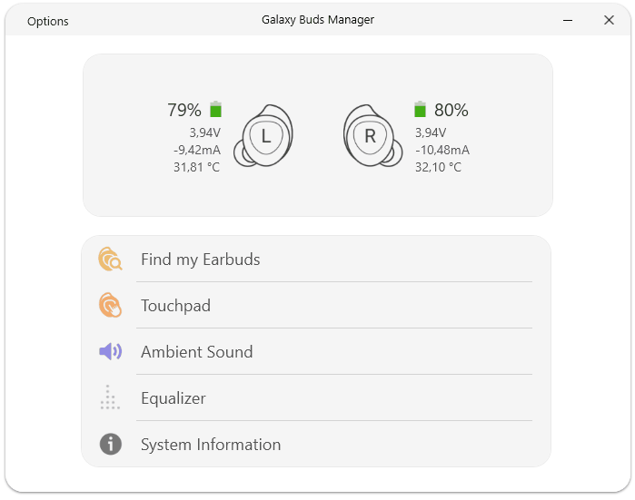

# Galaxy Buds Client
An unofficial Galaxy Buds Manager for Windows (Buds/Buds+)

(You can find downloads on the bottom)

<p align="center">
  
</p>

This Client is a product of my research on the custom RFComm Serial Protocol the Buds use to receive and send binary (configuration) data. If you are interested in the structure of the protocol and its serial messages, I recommend you to [check my notes out](GalaxyBudsRFCommProtocol.md) which I took while reverse-engineering the whole thing.

## Features

**New features** (in addition to the existing ones):

* Touchpad: Customizable tap-and-hold actions (launch application, toggle equalizer, change ambient volume, ...)<sup>[1]</sup>
* Systray context menu with battery statistics
* Display detailed sensor statistics on the dashboard, this includes:
  * Voltage and Current of the in-built ADC (Analog-to-Digital converter) of both Earbuds
  * Temperature of both Earbuds
  * More precise battery percentage (instead of steps of 5)
* Perform a self-test with all on-board components
* Display various (debug) information, including:
  * Hardware Revision
  * (Touch) Firmware Version
  * Bluetooth Addresses of both Earbuds
  * Serial Numbers of both Earbuds
  * Firmware Build Info (Compile Date, Developer Name)
  * Battery Type
  * Other sensor data
* Equalizer: unlock 'Optimize for Dolby' feature
* Touchpad: Combine Volume Up/Down with other options<sup>[1]</sup>

> <sup>[1]</sup> Note that the Wearable app will automatically reset this feature when attempting to switch Touchpad options in their app

## Installation

**This app requires .Net Framework 4.6.1 or higher** ([Download](https://dotnet.microsoft.com/download/dotnet-framework/net461))

You can [**download**](https://github.com/ThePBone/GalaxyBudsClient/releases) a fully automated Setup in the [**release section**](https://github.com/ThePBone/GalaxyBudsClient/releases) of this repo!

The original **Galaxy Buds (2019)** and **Galaxy Buds Plus** are fully supported.


Alternatively, you can also use the chocolatey package provided by [@superbonaci](https://github.com/superbonaci):

```
choco install galaxybudsclient
```


## Contributors

* [@superbonaci](https://github.com/superbonaci) - Chocolatey package


___

Bitcoin: 3EawSB3NfX6JQxKBBFYh6ZwHDWXtJB84Ly

