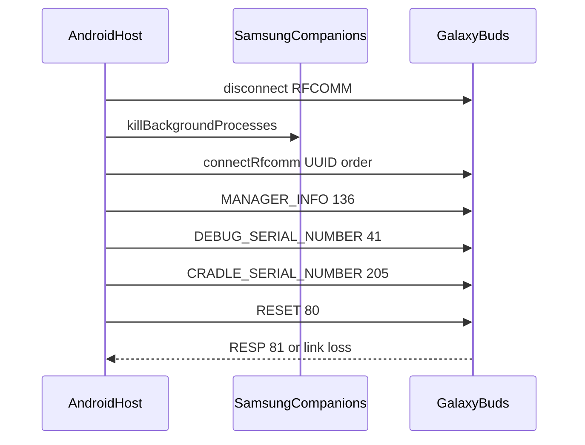

# Android RFCOMM host notes

Galaxy Buds Client on **desktop** opens the Samsung SPP/RFCOMM control socket from Windows, macOS, or Linux. On **Android**, the same socket is used by Samsung’s companion stack (`paranmgr`, `budsunitemgr`, Galaxy Wearable plugins). A second client (custom refurb tooling, experiments, or this app’s Android build) must compete for a **single** RFCOMM channel per bonded buds case.

This document summarizes host-side behavior validated on Samsung refurb tablets; wire format details remain in [GalaxyBudsRFCommProtocol.md](../GalaxyBudsRFCommProtocol.md) and `SppMessage.cs`.

## Service UUID

Bonded Galaxy Buds typically advertise the Samsung primary RFCOMM service:

| UUID | Role |
|------|------|
| `2e73a4ad-332d-41fc-90e2-16bef06523f2` | Primary Samsung hearable control (preferred) |
| `00001102-0000-1000-8000-00805f9b34fb` | Generic SPP (fallback on some stacks) |
| `00001101-0000-1000-8000-00805f9b34fb` | Serial port profile (last resort) |

Clients should try UUIDs in that order when opening `BluetoothSocket` / `createRfcommSocketToServiceRecord`.

## Samsung packages that hold RFCOMM

| Package | Notes |
|---------|--------|
| `com.samsung.accessory.paranmgr` | Survives Galaxy Wearable uninstall; holds SPP on many hosts |
| `com.samsung.accessory.budsunitemgr` | Buds3 / Buds4 unit manager + SPP plugin |

`ActivityManager.killBackgroundProcesses` and `am force-stop` are **not** reliable enough for exclusive wipe on dedicated refurb hosts. IT often **disables** both packages once per bench tablet (`pm disable-user --user 0 …`) and re-enables when the device returns to normal use.

**Do not** disable these on daily-driver phones if you still use official Galaxy Buds / Wearable features.

## Exclusive session pattern

When another app may hold the socket:

1. Disconnect RFCOMM while the operator confirms a destructive action.
2. Quiesce Samsung companion processes (`killBackgroundProcesses` on installed packages above).
3. Reconnect with retries (backoff); open the socket exclusively.
4. Run `MANAGER_INFO` (136) handshake, then debug/collect commands.
5. For factory reset (msg id **80**), send `RESET` and wait for `RESP` (81) with result code **0**. Link loss immediately after the write is often success (buds reboot).

## Case serial (msg 205)

`CRADLE_SERIAL_NUMBER` is exposed in Galaxy Buds Client for models that declare `Features.CradleSerialNumber` (Buds2 Pro, Buds3 family, **Buds4 Pro**, etc.). **Base Galaxy Buds4** (`Buds4DeviceSpec`) does **not** include that feature: msg 205 often times out with no payload—use the retail box **S/N (C)** manually.

Keep buds seated in the case with the lid open when probing case serial on supported models.

## Legacy firmware strings (msg 40)

2019 Galaxy Buds may embed ASCII **NUL** (`0x00`) inside `DEBUG_BUILD_INFO` payloads (e.g. between `R` and the build date). Strip null bytes before displaying or storing build strings to avoid downstream UTF-8/Postgres issues. See `DebugBuildInfoDecoder` and `DebugBuildInfoDecoderTests`.

## Related

- Desktop connection issues: main [README.md](../README.md) (background Samsung apps).
- Case serial decoder: `Message/Decoder/CradleSerialNumberDecoder.cs`.
- System info UI: requests cradle serial only when `Features.CradleSerialNumber` is supported.
